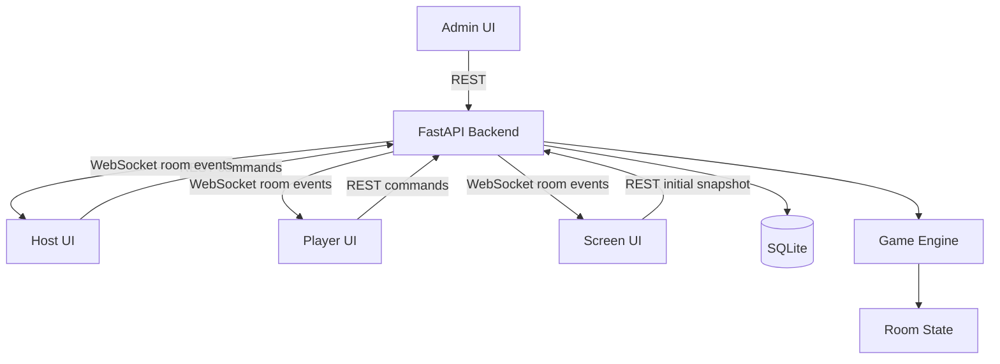
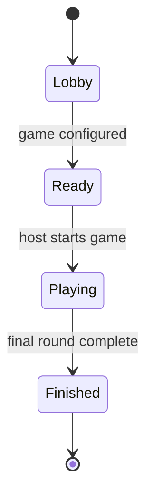
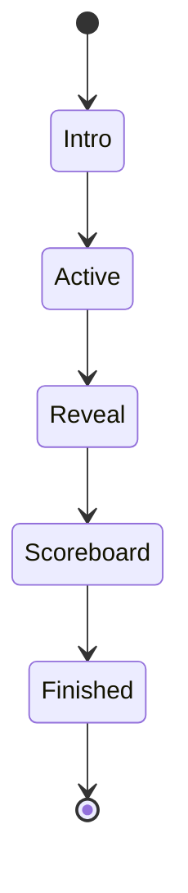

# Karaoke Party Architecture

## Purpose

Karaoke Party is a family browser party game for shared music and karaoke sessions.
The system has four user-facing surfaces:

- Screen: the main public game screen for a TV, monitor, projector, or laptop.
- Host: the moderator interface for creating rooms and controlling game flow.
- Player: a game participant, either connected from a personal device or created locally by the host.
- Admin: content management for songs, game packs, and operational data.

The backend is the source of truth for game state.
Clients display state and send intents, but they do not independently calculate critical game progress, scoring, round transitions, or results.

---

## Design Goals

- Keep the first version simple enough to build and maintain without premature infrastructure.
- Make game modes extensible without forcing a large framework around them too early.
- Keep all critical state transitions on the backend.
- Support reconnecting clients by letting them fetch the current room snapshot.
- Use REST for explicit commands and content management.
- Use WebSocket for room state updates and realtime gameplay events.
- Keep remote Player and Host interfaces usable on phones, and Screen optimized for 16:9 displays.
- Keep player identity independent from connection state so local players can be added later.
- Keep scoring ownership explicit so future modes can score either players or teams.

---

## System Overview



The backend owns persistent data, active rooms, game state transitions, scoring, and broadcast events.
Frontend clients are thin interaction surfaces around the backend state.

---

## Runtime Architecture

### Frontend

The frontend is a React + TypeScript + Vite application with separate routes for the four interfaces:

- `/screen/:roomCode` for the shared Screen interface.
- `/host/:roomCode` for the Host interface.
- `/player/:roomCode` for the Player interface.
- `/admin` for content administration.

Recommended frontend structure:

```text
frontend/
  src/
    app/
      App.tsx
      routes.tsx
    api/
      client.ts
      rooms.ts
      songs.ts
      gamePacks.ts
    realtime/
      roomSocket.ts
      events.ts
    stores/
      roomStore.ts
      playerStore.ts
    features/
      screen/
      host/
      player/
      admin/
      game/
    shared/
      components/
      styles/
      types/
```

Ant Design should be used for Admin and ordinary control surfaces: forms, tables, modals, selects, inputs, tabs, notifications, and pagination.
Custom React components with SCSS Modules should be used for game-facing UI: Screen layouts, scoreboards, answer buttons, timers, round cards, and animations.

Zustand should hold only shared client state that multiple views need, such as the latest room snapshot, current player identity, socket connection status, and transient UI state.
Component-local UI state should stay local.

### Backend

The backend is a FastAPI application with SQLAlchemy and SQLite.
It exposes REST endpoints for commands and content management, plus WebSocket endpoints for room updates.

Recommended backend structure:

```text
backend/
  app/
    main.py
    api/
      routes/
        rooms.py
        players.py
        host.py
        songs.py
        game_packs.py
      schemas/
    db/
      database.py
      models.py
      seed.py
    game/
      engine.py
      modes/
      state.py
      scoring.py
      events.py
    realtime/
      manager.py
      messages.py
    settings.py
```

The backend should avoid repository/service/use-case layers until the code earns them.
Business logic can start in small game and API modules, then move into focused functions when handlers become hard to read.

### Infrastructure

The initial deployment shape is Docker Compose with three main services:

- `backend`: FastAPI application.
- `frontend`: built Vite static assets.
- `caddy`: reverse proxy and static file server.

SQLite should be stored on a mounted volume.
Redis, background queues, or pub/sub infrastructure should not be introduced until active requirements demand multi-process room coordination or heavier asynchronous work.

---

## Domain Model

### Core Entities

| Entity | Purpose |
|---|---|
| Room | A temporary game session identified by a short room code. |
| Player | A participant in a room. A player may be remote or local and may optionally belong to a team. |
| Team | A named group of players that can participate and receive points as one side. |
| Host | The controller role for room setup and game progression. |
| Song | A karaoke or music prompt asset managed in Admin. |
| Game Pack | A curated set of songs or prompts used for a session. |
| Game Mode | The rule set for a round or full game. |
| Round | One playable step inside a game session. |
| Answer / Action | A player intent submitted during a round. |
| Score | Backend-owned points assigned to a score target, which is either a Player or a Team. |

### Player Participation

Player identity must not depend on a phone, browser session, or active WebSocket connection.
The domain should distinguish two participation types:

- `remote`: the player joined from a personal device and may have a player token and active connection.
- `local`: the player was created by the host and plays without a personal device.

The host will eventually be able to create, rename, and remove local players.
Remote players are part of the initial implementation path; local-player commands and UI are deferred.
Connection presence is transient metadata and must not determine whether a Player exists in the room.

### Teams and Scoring

A Room should support a play format such as `individual` or `team`.
A Player may have an optional `teamId`; no team membership is required in individual play.
Score operations should identify their target explicitly as a player or a team instead of assuming every score belongs to a player.

The initial implementation should support individual scoring only.
Team creation, team assignment, team scoring behavior, and team-mode UI are deferred, but room snapshots, engine boundaries, and score representations must not make individual play the only possible model.

### Room State

A Room owns a `GameState` whose status represents the lifecycle of the whole game.
The current `RoundState` has a separate phase so round progression is not encoded as room-wide statuses.
The first version can keep active room state in process memory while persisting durable content and completed results as needed.
If the backend restarts, active rooms may be lost unless persistence is added intentionally.



While the game is playing, each round follows its own lifecycle:



Every transition should be triggered by a backend command or backend timer.
Clients may request transitions, but the backend decides whether the transition is valid.

---

## API Boundaries

### REST

REST endpoints should be used for:

- Creating and joining rooms.
- Future host management of local players and teams.
- Loading the current room snapshot after page load or reconnect.
- Host commands such as start game, next round, reveal answer, pause, resume, and end game.
- Player commands such as submit answer, buzz in, vote, or choose an option.
- Admin CRUD for songs, game packs, and content metadata.

Endpoints should accept user intent, validate it against backend state, apply the state transition, then broadcast the resulting room event when needed.

Example endpoint groups:

```text
POST /api/rooms
GET  /api/rooms/{room_code}
POST /api/rooms/{room_code}/join
# Deferred: POST /api/rooms/{room_code}/host/players
# Deferred: POST /api/rooms/{room_code}/host/teams
POST /api/rooms/{room_code}/game/configure
POST /api/rooms/{room_code}/game/start
POST /api/rooms/{room_code}/game/round/activate
POST /api/rooms/{room_code}/game/round/reveal
POST /api/rooms/{room_code}/game/round/scoreboard
POST /api/rooms/{room_code}/game/round/finish
POST /api/rooms/{room_code}/game/actions

GET  /api/songs
POST /api/songs
PUT  /api/songs/{song_id}
DELETE /api/songs/{song_id}

GET  /api/game-packs
POST /api/game-packs
PUT  /api/game-packs/{pack_id}
DELETE /api/game-packs/{pack_id}
```

### WebSocket

WebSocket should be used for realtime room synchronization.
Each client connects to a room channel and receives events from the backend.

```text
WS /ws/rooms/{room_code}
```

Events should be typed and versioned enough to evolve safely.
The initial notification contract contains no room snapshot or private data:

```json
{
  "type": "room.updated",
  "roomCode": "ABCD",
  "version": 12
}
```

Use monotonically increasing room versions so clients can ignore stale messages and decide when to refetch a snapshot.

---

## Realtime Contract

The backend sends `room.connected` after connection and `room.updated` after a
successful public state change. Both events contain only the room code and
current version.

Playback-only Host actions use a deliberately small ephemeral contract:

```json
{
  "type": "screen.command",
  "roomCode": "ABCD",
  "command": "continue_audio"
}
```

The event is emitted only after `POST /api/rooms/{room_code}/screen/commands`
authenticates the room Host and validates the current Guess Song state. It is not
a Game Engine transition, is not placed in `RoomSnapshot`, and does not increment
`Room.version`. Rejected commands emit no event. This is a focused playback
contract rather than a generic command bus.

Clients should treat WebSocket events as hints that backend state changed.
For complex recovery, reconnect, or version mismatch, the client should fetch `GET /api/rooms/{room_code}` and replace local room state with the backend snapshot.

Screen uses the same room WebSocket connection but reloads the role-specific
`GET /api/rooms/{room_code}/screen` snapshot. That response may add safe
playback metadata for the active Guess Song round; Player and Host room
snapshots do not receive it. Versioned room events remain metadata-free; the
ephemeral Screen command carries only its fixed command name.

The WebSocket manager tracks public connections by room in one backend process.
It must not equate a Player with a WebSocket connection: local players have no connection, and remote players remain room participants while temporarily disconnected.
It should not own game rules.
Its job is delivery, not deciding state.

---

## Game Engine

The game engine is backend code that validates commands and produces new room state plus events.
It should not know about React, Ant Design, browser routes, or CSS.

Initial engine responsibilities:

- Validate whether a host or player command is allowed in the current room state.
- Start and finish rounds.
- Store current prompt and answer state.
- Calculate scores for an explicit Player or Team target.
- Produce deterministic state changes that the API layer can announce.

Game modes should be implemented as small modules behind a simple interface.
Avoid building a large plugin system initially.
A mode should define:

- Required setup fields.
- How a round is selected.
- Which player actions are accepted.
- How round results are calculated.
- What public state each role can see.

`GuessSongMode` uses the common round lifecycle without adding an answering or
judging phase. Its mode-specific round state stores the selected song, current
responder, excluded players, winner, and judging status. Only responder and
excluded-player ids are public while the round is active; title, artist, and
optional year enter the public result only after reveal. Audio filenames remain
private backend metadata.

Buzz actions are serialized by the existing `RoomStore` lock. The first valid
buzz sets the responder and increments the room version once; competing or
repeated buzzes are conflicts and do not change version or broadcast. Host
judging uses one authenticated `round/judge` command. A wrong judgement clears
the responder and excludes that player while leaving the round active. A
correct judgement reveals the round with its winner. Manual reveal without a
winner is allowed whenever no responder awaits judgement, including after all
players are exhausted or when the host ends attempts early.

Song media is addressed publicly by Song id through
`GET /api/media/songs/{song_id}`. The backend resolves the manifest-owned
filename under the configured media directory and rejects missing files or any
resolved path outside that directory. Clients never submit or receive a local
filesystem path. Screen alone owns `HTMLAudioElement` playback; Host and Player
only issue commands and render authoritative snapshots. Screen also owns the
local playback position and presentation states such as listening, fragment
ended, media exhausted, and playback error. A Host `continue_audio` command
starts one more `previewDuration` segment from the Screen's current position.
It never changes round phase or causes reveal, judging, scoring, or a room version
increment. After refresh, exact playback position may be lost and playback may
restart at `previewStart` after a new user gesture; no server-synchronized audio
clock or Screen-to-Host playback telemetry exists in the MVP.

---

## Data Storage

SQLite is the initial database.
It should store durable content and enough metadata to administer and replay the game later when needed.

Initial durable tables:

- `songs`
- `game_packs`
- `game_pack_songs`
- `rooms`
- `players`
- `game_results`

The domain model should reserve clear relationships for optional player-to-team membership and player-or-team score targets.
Tables or columns used only by local-player and team-mode behavior should be added when those features are implemented, rather than introducing unused persistence now.

Active room state can start in memory for simplicity.
If preserving active games through backend restarts becomes a requirement, persist room snapshots or event logs deliberately rather than half-persisting scattered state.

Song audio/video files should not be committed into application source unless they are tiny sample assets.
Use `data/` for local development content and document any production storage decision when it is made.

---

## Frontend State Flow

Each client should follow the same synchronization pattern:

1. Load initial room snapshot over REST.
2. Open WebSocket connection for the room.
3. Apply backend events to the local room store.
4. Submit user actions through REST commands.
5. Refetch the snapshot after reconnect, version mismatch, or unrecoverable event parsing.

Player and Host clients should keep optimistic UI limited to temporary feedback such as disabled buttons or loading states.
They should not locally award points, advance rounds, or reveal answers without backend confirmation.

---

## Role-Specific UI Responsibilities

### Screen

Screen displays the public game state:

- Room code and join instructions in lobby.
- Current round prompt.
- Timer or progress indicator.
- Accepted public player actions when the mode exposes them.
- Reveals, results, and scoreboard.

Screen should favor custom visual components and layouts tuned for 16:9 while remaining usable on a projector, monitor, or laptop.

### Host

Host controls the session:

- Create or resume room.
- Select game pack and mode.
- Start, pause, resume, and end game.
- Move to the next round.
- Resolve manual judging when a mode needs it.
- Eventually create and manage local players and teams.

Host should be comfortable on a phone and tablet.
Use Ant Design where it fits controls, but keep game controls large and touch-friendly.

### Player

A remote player joins by room code and display name.
The Player UI is only the remote player's interaction surface; the Player domain entity also covers local participants without a device.
Remote Player UI should be minimal during active play:

- Show current personal status.
- Submit answers or actions.
- Display accepted/rejected feedback.
- Show score and result summaries.

Remote player identity uses a locally stored token returned by the backend when joining.
Protected player actions send that token as an HTTP Bearer credential; account-based authentication remains deferred.

### Admin

Admin manages content:

- Songs.
- Game packs.
- Song metadata.
- Basic validation and import/export workflows.

Admin should use Ant Design heavily because it is data-entry oriented.

---

## Error Handling

REST command responses should distinguish:

- Validation errors for malformed input.
- State conflicts for commands that are not allowed in the current room state.
- Not found errors for missing rooms, players, songs, or packs.
- Server errors for unexpected failures.

WebSocket events should not be the only place where command errors appear.
The command response should tell the initiating client whether the backend accepted the action.

Clients should show concise, role-appropriate errors.
Player-facing errors should be short.
Host and Admin can show more operational detail.

---

## Security and Trust Boundaries

The first version can keep authentication light, but trust boundaries should still be explicit:

- Host commands require a host token for the room.
- Player commands require a player token for the room.
- Host commands that manage future local players or teams require the room's host token.
- Admin should not be publicly exposed without access control in any deployed environment.
- Scores and round outcomes are calculated only on the backend.
- Client-submitted data is validated on the backend.

Room codes should be short enough to share verbally but random enough to avoid casual guessing.
Tokens should not be derived from room codes.

---

## Testing Strategy

Backend tests should cover:

- Game engine state transitions.
- Scoring logic.
- REST command validation.
- WebSocket broadcast behavior at the manager boundary.
- Snapshot recovery after reconnect.

Frontend tests should cover:

- API client behavior.
- Zustand store reducers or update helpers.
- Role-specific screens for key states.
- Mobile layout checks for Host and remote Player when browser testing is added.

End-to-end tests should focus on the main happy path:

1. Host creates room.
2. Player joins.
3. Host starts game.
4. Player submits action.
5. Backend updates score.
6. Screen, Host, and Player reflect the same room state.

---

## Development Phases

### Phase 1: Project Skeleton

- Initialize frontend and backend applications.
- Add the Docker development setup.
- Add a backend health endpoint.
- Establish frontend routing.
- Add basic project configuration.

### Phase 2: Room Backend

- Create rooms.
- Join remote players.
- Establish backend-owned room state.
- Provide the REST room snapshot.

### Phase 3: Game Engine

- Implement the room and round state machine.
- Implement basic transitions.
- Implement individual player scoring with an explicit score-target model that can later support teams.
- Add unit tests for transitions and scoring.
- Define the minimal `GameMode` interface.

### Phase 4: Realtime

- Add WebSocket room connections.
- Broadcast room events.
- Restore state after reconnect through the REST snapshot.
- Synchronize monotonically increasing room versions and recover from version mismatches.

### Phase 5: Lobby UI

- Build Screen, Host, and remote Player lobby views.
- Add QR-code and room-code joining.

### Phase 6: First Playable Mode

- Implement Guess Song.
- Add buzz actions.
- Determine the first accepted player on the backend.
- Let the host judge the answer as correct or wrong.
- Apply scoring.
- Display the scoreboard.

### Phase 7: Content Management

- Add Song storage and management.
- Add Game Pack storage and management.
- Build Admin CRUD.
- Add seed data.

### Phase 8: Additional Game Modes and Deployment Hardening

- Add game modes as concrete requirements are defined.
- Add production Docker Compose and Caddy configuration.
- Add deployment access controls, builds, and operational documentation.
- Revisit local players and team mode as separate features; they are not part of Phases 1-7.

---

## Deferred Decisions

These decisions should stay deferred until concrete requirements make them necessary:

- Persistent active room recovery after backend restart.
- Redis or other multi-process realtime coordination.
- User accounts.
- Local-player management and host UI.
- Team creation, assignment, team-mode rules, and team scoring UI.
- Cloud media storage.
- Advanced song import pipelines.
- Public moderation tools.
- Analytics and telemetry.

Deferring these keeps the first version focused on a working family party game rather than infrastructure that may never be needed.
